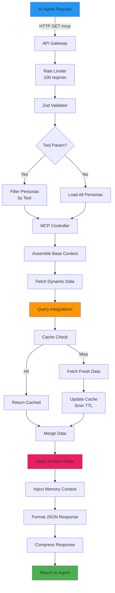

# MCP Core Workflow

```mermaid
graph TD
    A[AI Agent Request] -->|HTTP GET /mcp| B[API Gateway]
    B --> C[Rate Limiter<br/>100 req/min]
    C --> D[Zod Validator]
    D --> E{Tool Param?}
    
    E -->|Yes| F[Filter Personas<br/>by Tool]
    E -->|No| G[Load All Personas]
    
    F --> H[MCP Controller]
    G --> H
    
    H --> I[Assemble Base Context]
    I --> J[Fetch Dynamic Data]
    
    J --> K[Query Integrations]
    K --> L[Cache Check]
    
    L -->|Hit| M[Return Cached]
    L -->|Miss| N[Fetch Fresh Data]
    
    N --> O[Update Cache<br/>5min TTL]
    M --> P[Merge Data]
    O --> P
    
    P --> Q[Apply Emotion State]
    Q --> R[Inject Memory Context]
    R --> S[Format JSON Response]
    
    S --> T[Compress Response]
    T --> U[Return to Agent]
    
    style A fill:#2196F3
    style U fill:#4CAF50
    style K fill:#FF9800
    style Q fill:#E91E63
``` 