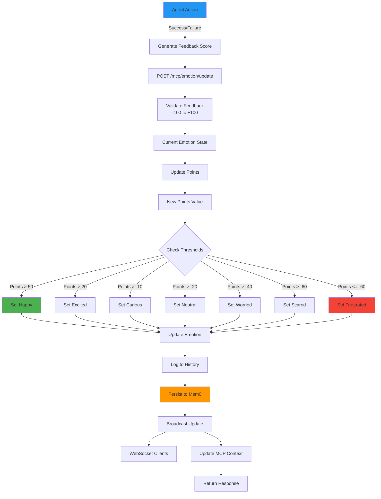

# Emotion System Workflow

```mermaid
graph TD
    A[Agent Action] -->|Success/Failure| B[Generate Feedback Score]
    B --> C[POST /mcp/emotion/update]
    
    C --> D[Validate Feedback<br/>-100 to +100]
    D --> E[Current Emotion State]
    
    E --> F[Update Points]
    F --> G[New Points Value]
    
    G --> H{Check Thresholds}
    
    H -->|Points > 50| I[Set Happy]
    H -->|Points > 20| J[Set Excited]
    H -->|Points > -10| K[Set Curious]
    H -->|Points > -20| L[Set Neutral]
    H -->|Points > -40| M[Set Worried]
    H -->|Points > -60| N[Set Scared]
    H -->|Points <= -60| O[Set Frustrated]
    
    I --> P[Update Emotion]
    J --> P
    K --> P
    L --> P
    M --> P
    N --> P
    O --> P
    
    P --> Q[Log to History]
    Q --> R[Persist to Mem0]
    
    R --> S[Broadcast Update]
    S --> T[WebSocket Clients]
    S --> U[Update MCP Context]
    
    U --> V[Return Response]
    
    style A fill:#2196F3
    style I fill:#4CAF50
    style O fill:#F44336
    style R fill:#FF9800
``` 