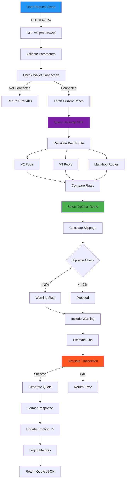

# DeFi Swap Workflow

```mermaid
graph TD
    A[User Request Swap] -->|ETH to USDC| B[GET /mcp/defi/swap]
    
    B --> C[Validate Parameters]
    C --> D[Check Wallet Connection]
    
    D -->|Not Connected| E[Return Error 403]
    D -->|Connected| F[Fetch Current Prices]
    
    F --> G[Query Uniswap SDK]
    G --> H[Calculate Best Route]
    
    H --> I[V2 Pools]
    H --> J[V3 Pools]
    H --> K[Multi-hop Routes]
    
    I --> L[Compare Rates]
    J --> L
    K --> L
    
    L --> M[Select Optimal Route]
    M --> N[Calculate Slippage]
    
    N --> O{Slippage Check}
    O -->|> 2%| P[Warning Flag]
    O -->|<= 2%| Q[Proceed]
    
    P --> R[Include Warning]
    Q --> R
    
    R --> S[Estimate Gas]
    S --> T[Simulate Transaction]
    
    T -->|Success| U[Generate Quote]
    T -->|Fail| V[Return Error]
    
    U --> W[Format Response]
    W --> X[Update Emotion +5]
    X --> Y[Log to Memory]
    Y --> Z[Return Quote JSON]
    
    style A fill:#2196F3
    style G fill:#7B1FA2
    style M fill:#4CAF50
    style T fill:#FF5722
``` 