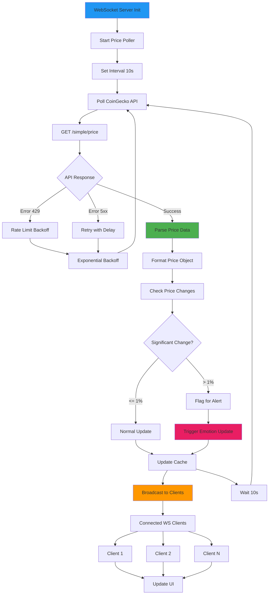

# Real-Time Price Streaming Workflow

```mermaid
graph TD
    A[WebSocket Server Init] --> B[Start Price Poller]
    B --> C[Set Interval 10s]
    
    C --> D[Poll CoinGecko API]
    D --> E[GET /simple/price]
    
    E --> F{API Response}
    F -->|Success| G[Parse Price Data]
    F -->|Error 429| H[Rate Limit Backoff]
    F -->|Error 5xx| I[Retry with Delay]
    
    H --> J[Exponential Backoff]
    I --> J
    J --> D
    
    G --> K[Format Price Object]
    K --> L[Check Price Changes]
    
    L --> M{Significant Change?}
    M -->|> 1%| N[Flag for Alert]
    M -->|<= 1%| O[Normal Update]
    
    N --> P[Trigger Emotion Update]
    O --> Q[Update Cache]
    P --> Q
    
    Q --> R[Broadcast to Clients]
    
    R --> S[Connected WS Clients]
    S --> T[Client 1]
    S --> U[Client 2]
    S --> V[Client N]
    
    T --> W[Update UI]
    U --> W
    V --> W
    
    Q --> X[Wait 10s]
    X --> D
    
    style A fill:#2196F3
    style G fill:#4CAF50
    style P fill:#E91E63
    style R fill:#FF9800
``` 