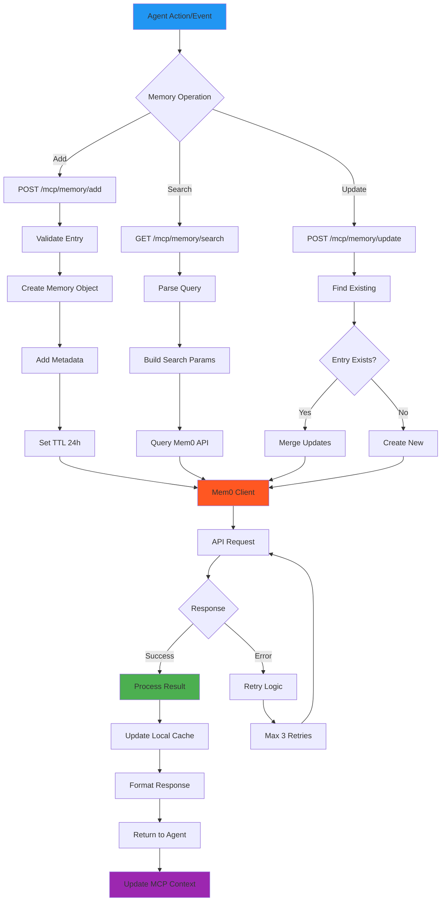

# Memory Management Workflow

```mermaid
graph TD
    A[Agent Action/Event] --> B{Memory Operation}
    
    B -->|Add| C[POST /mcp/memory/add]
    B -->|Search| D[GET /mcp/memory/search]
    B -->|Update| E[POST /mcp/memory/update]
    
    C --> F[Validate Entry]
    D --> G[Parse Query]
    E --> H[Find Existing]
    
    F --> I[Create Memory Object]
    I --> J[Add Metadata]
    J --> K[Set TTL 24h]
    
    G --> L[Build Search Params]
    L --> M[Query Mem0 API]
    
    H --> N{Entry Exists?}
    N -->|Yes| O[Merge Updates]
    N -->|No| P[Create New]
    
    K --> Q[Mem0 Client]
    M --> Q
    O --> Q
    P --> Q
    
    Q --> R[API Request]
    R --> S{Response}
    
    S -->|Success| T[Process Result]
    S -->|Error| U[Retry Logic]
    
    U --> V[Max 3 Retries]
    V --> R
    
    T --> W[Update Local Cache]
    W --> X[Format Response]
    
    X --> Y[Return to Agent]
    Y --> Z[Update MCP Context]
    
    style A fill:#2196F3
    style Q fill:#FF5722
    style T fill:#4CAF50
    style Z fill:#9C27B0
``` 