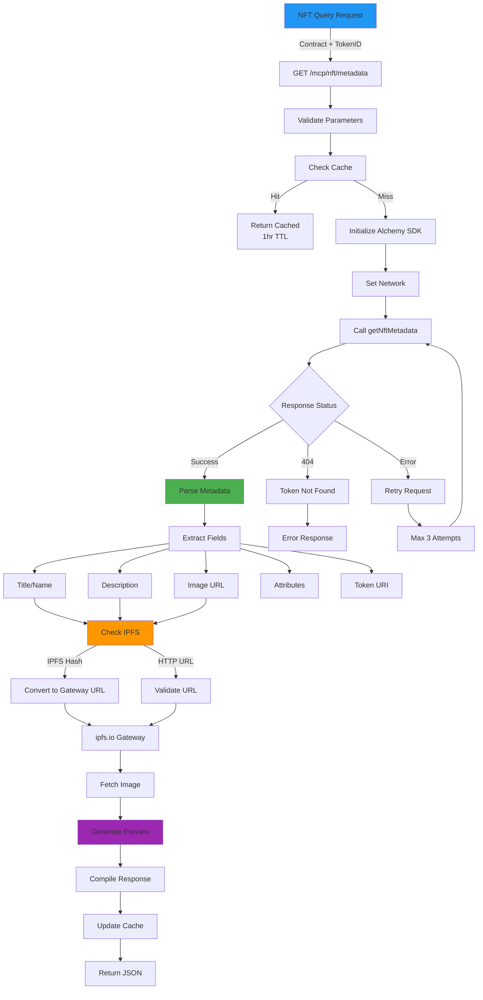

# NFT Metadata Workflow

```mermaid
graph TD
    A[NFT Query Request] -->|Contract + TokenID| B[GET /mcp/nft/metadata]
    
    B --> C[Validate Parameters]
    C --> D[Check Cache]
    
    D -->|Hit| E[Return Cached<br/>1hr TTL]
    D -->|Miss| F[Initialize Alchemy SDK]
    
    F --> G[Set Network]
    G --> H[Call getNftMetadata]
    
    H --> I{Response Status}
    I -->|Success| J[Parse Metadata]
    I -->|404| K[Token Not Found]
    I -->|Error| L[Retry Request]
    
    L --> M[Max 3 Attempts]
    M --> H
    
    J --> N[Extract Fields]
    N --> O[Title/Name]
    N --> P[Description]
    N --> Q[Image URL]
    N --> R[Attributes]
    N --> S[Token URI]
    
    O --> T[Check IPFS]
    P --> T
    Q --> T
    
    T -->|IPFS Hash| U[Convert to Gateway URL]
    T -->|HTTP URL| V[Validate URL]
    
    U --> W[ipfs.io Gateway]
    V --> W
    
    W --> X[Fetch Image]
    X --> Y[Generate Preview]
    
    Y --> Z[Compile Response]
    Z --> AA[Update Cache]
    AA --> AB[Return JSON]
    
    K --> AC[Error Response]
    
    style A fill:#2196F3
    style J fill:#4CAF50
    style T fill:#FF9800
    style Y fill:#9C27B0
``` 