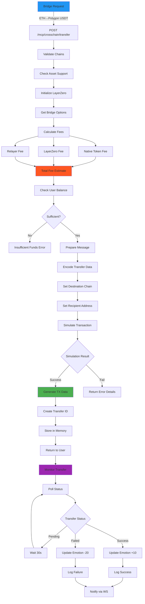

# Cross-Chain Bridge Workflow

```mermaid
graph TD
    A[Bridge Request] -->|ETH→Polygon USDT| B[POST /mcp/crosschain/transfer]
    
    B --> C[Validate Chains]
    C --> D[Check Asset Support]
    
    D --> E[Initialize LayerZero]
    E --> F[Get Bridge Options]
    
    F --> G[Calculate Fees]
    G --> H[Native Token Fee]
    G --> I[LayerZero Fee]
    G --> J[Relayer Fee]
    
    H --> K[Total Fee Estimate]
    I --> K
    J --> K
    
    K --> L[Check User Balance]
    L --> M{Sufficient?}
    
    M -->|No| N[Insufficient Funds Error]
    M -->|Yes| O[Prepare Message]
    
    O --> P[Encode Transfer Data]
    P --> Q[Set Destination Chain]
    Q --> R[Set Recipient Address]
    
    R --> S[Simulate Transaction]
    S --> T{Simulation Result}
    
    T -->|Success| U[Generate TX Data]
    T -->|Fail| V[Return Error Details]
    
    U --> W[Create Transfer ID]
    W --> X[Store in Memory]
    
    X --> Y[Return to User]
    Y --> Z[Monitor Transfer]
    
    Z --> AA[Poll Status]
    AA --> AB{Transfer Status}
    
    AB -->|Pending| AC[Wait 30s]
    AB -->|Success| AD[Update Emotion +10]
    AB -->|Failed| AE[Update Emotion -20]
    
    AC --> AA
    AD --> AF[Log Success]
    AE --> AG[Log Failure]
    
    AF --> AH[Notify via WS]
    AG --> AH
    
    style A fill:#2196F3
    style K fill:#FF5722
    style U fill:#4CAF50
    style Z fill:#9C27B0
``` 