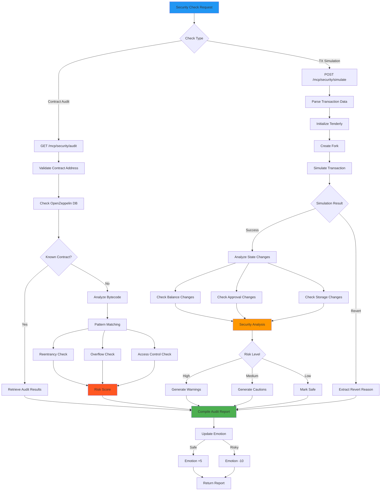

# Security Audit & Transaction Simulation Workflow

```mermaid
graph TD
    A[Security Check Request] --> B{Check Type}
    
    B -->|Contract Audit| C[GET /mcp/security/audit]
    B -->|TX Simulation| D[POST /mcp/security/simulate]
    
    C --> E[Validate Contract Address]
    D --> F[Parse Transaction Data]
    
    E --> G[Check OpenZeppelin DB]
    G --> H{Known Contract?}
    
    H -->|Yes| I[Retrieve Audit Results]
    H -->|No| J[Analyze Bytecode]
    
    J --> K[Pattern Matching]
    K --> L[Reentrancy Check]
    K --> M[Overflow Check]
    K --> N[Access Control Check]
    
    L --> O[Risk Score]
    M --> O
    N --> O
    
    F --> P[Initialize Tenderly]
    P --> Q[Create Fork]
    Q --> R[Simulate Transaction]
    
    R --> S{Simulation Result}
    S -->|Success| T[Analyze State Changes]
    S -->|Revert| U[Extract Revert Reason]
    
    T --> V[Check Balance Changes]
    T --> W[Check Approval Changes]
    T --> X[Check Storage Changes]
    
    V --> Y[Security Analysis]
    W --> Y
    X --> Y
    
    Y --> Z{Risk Level}
    Z -->|High| AA[Generate Warnings]
    Z -->|Medium| AB[Generate Cautions]
    Z -->|Low| AC[Mark Safe]
    
    O --> AD[Compile Audit Report]
    AA --> AD
    AB --> AD
    AC --> AD
    U --> AD
    I --> AD
    
    AD --> AE[Update Emotion]
    AE -->|Safe| AF[Emotion +5]
    AE -->|Risky| AG[Emotion -10]
    
    AF --> AH[Return Report]
    AG --> AH
    
    style A fill:#2196F3
    style O fill:#FF5722
    style Y fill:#FF9800
    style AD fill:#4CAF50
``` 