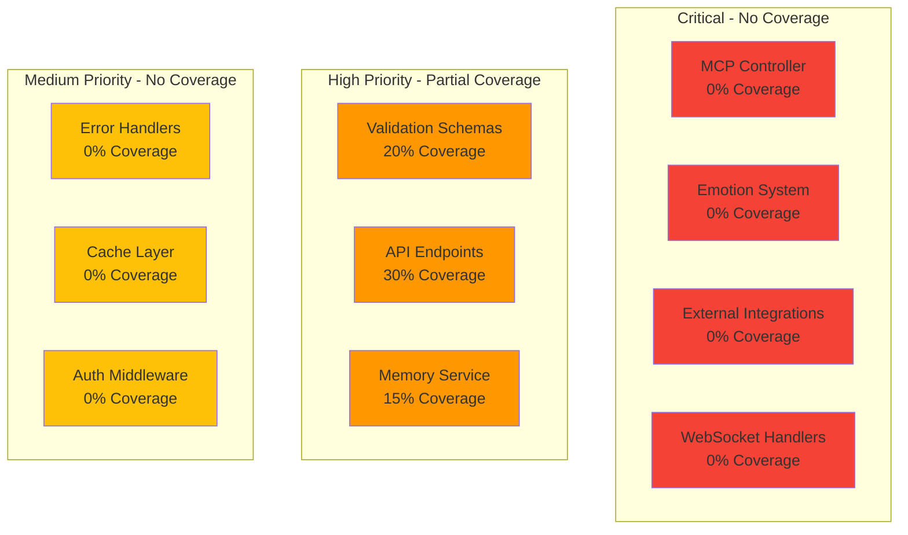

# Amazing-MCP Server: Test Backlog

## Overview
This document catalogs all missing test suites identified during the engineering audit. Tests are prioritized by business impact and implementation complexity.

## Test Coverage Heat Map



## Priority 1: Critical Unit Tests (Week 1-2)

### 1.1 MCP Controller Tests
**File**: `tests/unit/controllers/mcp.controller.test.ts`
```typescript
describe('MCPController', () => {
  describe('assembleMCP', () => {
    // Test cases needed:
    - ✗ Should return complete MCP context with all required fields
    - ✗ Should filter personas by tool parameter
    - ✗ Should handle missing tool parameter gracefully
    - ✗ Should merge static and dynamic data correctly
    - ✗ Should validate response against schema
    - ✗ Should handle cache hits and misses
    - ✗ Should update last accessed timestamp
  });
  
  describe('error handling', () => {
    - ✗ Should handle integration failures gracefully
    - ✗ Should return partial MCP on non-critical failures
    - ✗ Should log errors with correlation ID
  });
});
```

### 1.2 Emotion System Tests
**File**: `tests/unit/services/emotion.service.test.ts`
```typescript
describe('EmotionService', () => {
  describe('updateEmotion', () => {
    - ✗ Should transition emotions based on thresholds
    - ✗ Should cap points at -100 and +100
    - ✗ Should persist emotion history
    - ✗ Should broadcast emotion changes via WebSocket
    - ✗ Should handle concurrent updates safely
  });
  
  describe('emotion thresholds', () => {
    - ✗ Should transition to Happy when points > 50
    - ✗ Should transition to Excited when points > 20
    - ✗ Should transition to Worried when points < -20
    - ✗ Should handle edge cases at boundaries
  });
});
```

### 1.3 Validation Schema Tests
**File**: `tests/unit/schemas/mcp.schema.test.ts`
```typescript
describe('MCP Schema Validation', () => {
  - ✗ Should accept valid MCP structure
  - ✗ Should reject missing required fields
  - ✗ Should validate emotion enum values
  - ✗ Should validate point ranges
  - ✗ Should validate persona structure
  - ✗ Should handle additional properties
});
```

## Priority 2: Integration Tests (Week 2-3)

### 2.1 External API Integration Tests
**File**: `tests/integration/integrations/*.test.ts`

#### CoinGecko Integration
```typescript
describe('CoinGecko Integration', () => {
  - ✗ Should fetch real-time prices
  - ✗ Should handle rate limiting (429)
  - ✗ Should retry on transient failures
  - ✗ Should cache responses appropriately
  - ✗ Should handle malformed responses
});
```

#### Web3.js Integration
```typescript
describe('Web3 Integration', () => {
  - ✗ Should connect to RPC endpoint
  - ✗ Should fetch wallet balances
  - ✗ Should get transaction details
  - ✗ Should handle network errors
  - ✗ Should validate addresses
});
```

#### Mem0 Integration
```typescript
describe('Mem0 Memory Integration', () => {
  - ✗ Should add memories with metadata
  - ✗ Should search memories by query
  - ✗ Should update existing memories
  - ✗ Should handle API errors
  - ✗ Should respect TTL settings
});
```

### 2.2 Database Integration Tests
**File**: `tests/integration/db/*.test.ts`
```typescript
describe('Database Operations', () => {
  - ✗ Should handle connection pool exhaustion
  - ✗ Should execute transactions atomically
  - ✗ Should handle deadlocks gracefully
  - ✗ Should optimize slow queries
  - ✗ Should clean up connections
});
```

## Priority 3: End-to-End Tests (Week 3-4)

### 3.1 API E2E Tests
**File**: `tests/e2e/api/*.test.ts`

#### Critical User Journeys
```typescript
describe('MCP API E2E', () => {
  - ✗ Complete MCP fetch with persona filtering
  - ✗ Emotion update flow with persistence
  - ✗ Memory add and search operations
  - ✗ Real-time price subscription via WebSocket
  - ✗ DeFi swap quote generation
  - ✗ NFT metadata retrieval
  - ✗ Cross-chain transfer initiation
  - ✗ Security audit workflow
  - ✗ Error recovery scenarios
  - ✗ Rate limiting behavior
});
```

### 3.2 WebSocket E2E Tests
**File**: `tests/e2e/websocket/*.test.ts`
```typescript
describe('WebSocket Connections', () => {
  - ✗ Should establish connection
  - ✗ Should receive price updates
  - ✗ Should handle reconnection
  - ✗ Should respect subscription filters
  - ✗ Should handle concurrent connections
});
```

## Priority 4: Performance Tests (Week 4)

### 4.1 Load Tests
**File**: `tests/performance/load/*.js`
```javascript
// k6 load test scenarios needed:
- ✗ Baseline load (100 concurrent users)
- ✗ Stress test (1000 concurrent users)
- ✗ Spike test (sudden traffic increase)
- ✗ Soak test (sustained load for 24h)
- ✗ Breakpoint test (find system limits)
```

### 4.2 Performance Benchmarks
**File**: `tests/performance/benchmarks/*.test.ts`
```typescript
describe('Performance Benchmarks', () => {
  - ✗ MCP assembly time < 50ms
  - ✗ Database query time < 20ms
  - ✗ Cache retrieval time < 5ms
  - ✗ External API timeout handling
  - ✗ Memory usage under load
});
```

## Priority 5: Security Tests (Week 5)

### 5.1 Authentication Tests
**File**: `tests/security/auth/*.test.ts`
```typescript
describe('Authentication Security', () => {
  - ✗ Should reject invalid API keys
  - ✗ Should enforce rate limits per key
  - ✗ Should log failed attempts
  - ✗ Should rotate keys without downtime
  - ✗ Should validate JWT tokens
});
```

### 5.2 Input Validation Tests
**File**: `tests/security/validation/*.test.ts`
```typescript
describe('Input Security', () => {
  - ✗ Should prevent SQL injection
  - ✗ Should prevent XSS attacks
  - ✗ Should validate all user inputs
  - ✗ Should handle oversized payloads
  - ✗ Should reject malformed JSON
});
```

## Test Implementation Guidelines

### Test Structure
```typescript
// Standard test structure
describe('ComponentName', () => {
  let sut: SystemUnderTest;
  let mockDependency: MockType;
  
  beforeEach(() => {
    // Setup
    mockDependency = createMock();
    sut = new SystemUnderTest(mockDependency);
  });
  
  afterEach(() => {
    // Cleanup
    jest.clearAllMocks();
  });
  
  describe('methodName', () => {
    it('should handle happy path', async () => {
      // Arrange
      const input = createValidInput();
      const expected = createExpectedOutput();
      
      // Act
      const result = await sut.methodName(input);
      
      // Assert
      expect(result).toEqual(expected);
      expect(mockDependency.someMethod).toHaveBeenCalledWith(input);
    });
    
    it('should handle error case', async () => {
      // Arrange
      mockDependency.someMethod.mockRejectedValue(new Error('Test error'));
      
      // Act & Assert
      await expect(sut.methodName(input)).rejects.toThrow('Test error');
    });
  });
});
```

### Mocking Strategy
```typescript
// Mock external services
jest.mock('../integrations/coingecko', () => ({
  getCryptoPrices: jest.fn().mockResolvedValue({
    bitcoin: { usd: 50000 },
    ethereum: { usd: 3000 }
  })
}));

// Mock time-based operations
jest.useFakeTimers();

// Mock WebSocket
const mockWS = new MockWebSocket();
jest.mock('ws', () => mockWS);
```

### Test Data Builders
```typescript
// Use builder pattern for test data
class MCPContextBuilder {
  private context: Partial<MCPContext> = {};
  
  withPersona(persona: Persona): this {
    this.context.personas = [persona];
    return this;
  }
  
  withEmotion(emotion: Emotion): this {
    this.context.emotionSystem = { currentEmotion: emotion, points: 0 };
    return this;
  }
  
  build(): MCPContext {
    return {
      ...defaultMCPContext,
      ...this.context
    };
  }
}
```

## Test Metrics & Goals

### Coverage Targets
- **Unit Tests**: 85% coverage (Critical: 100%)
- **Integration Tests**: 70% coverage
- **E2E Tests**: 10 critical user journeys
- **Performance**: All endpoints tested
- **Security**: OWASP Top 10 covered

### Test Execution Time
- Unit tests: < 5 seconds
- Integration tests: < 30 seconds
- E2E tests: < 5 minutes
- Full suite: < 15 minutes

### Flakiness Target
- 0% flaky tests in CI
- Retry mechanism for external dependencies
- Deterministic test data

## Implementation Schedule

| Week | Focus | Deliverables | Success Criteria |
|------|-------|--------------|------------------|
| 1 | Critical Unit Tests | MCP Controller, Emotion System | 60% unit coverage |
| 2 | Integration Tests Setup | External APIs, Database | Mocking infrastructure |
| 3 | Integration Tests | All external services | 70% integration coverage |
| 4 | E2E Tests | Critical journeys | 10 scenarios passing |
| 5 | Performance Tests | Load, stress, spike | Baseline established |
| 6 | Security Tests | Auth, validation | OWASP coverage |

## Continuous Improvement

### Weekly Metrics Review
- Test coverage trends
- Flaky test identification
- Execution time optimization
- New test requirements

### Monthly Test Audit
- Remove obsolete tests
- Update test data
- Review mocking strategy
- Performance regression checks 